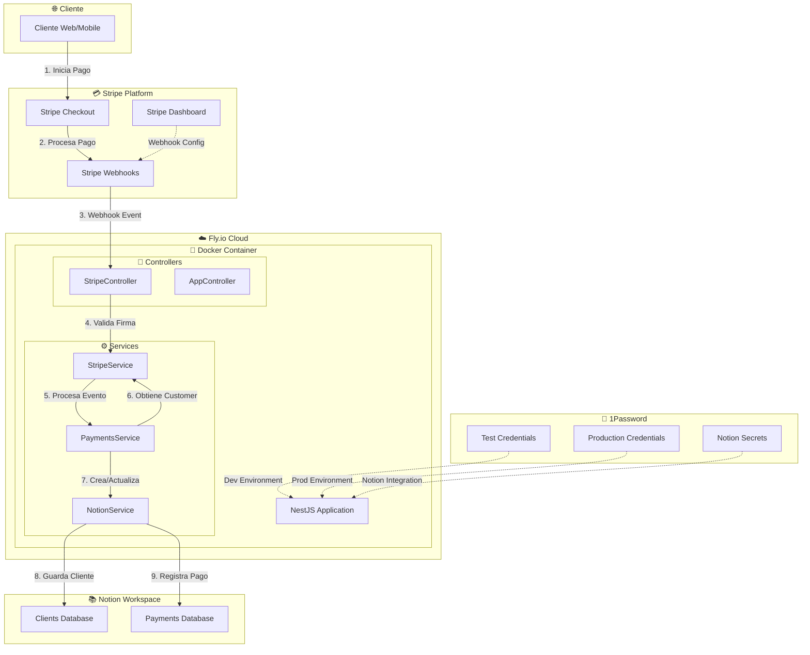
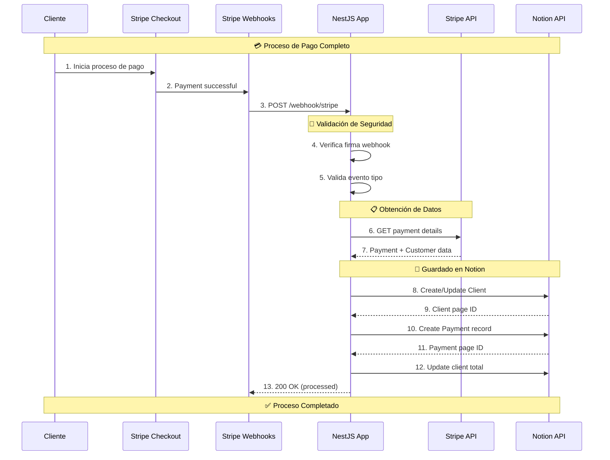
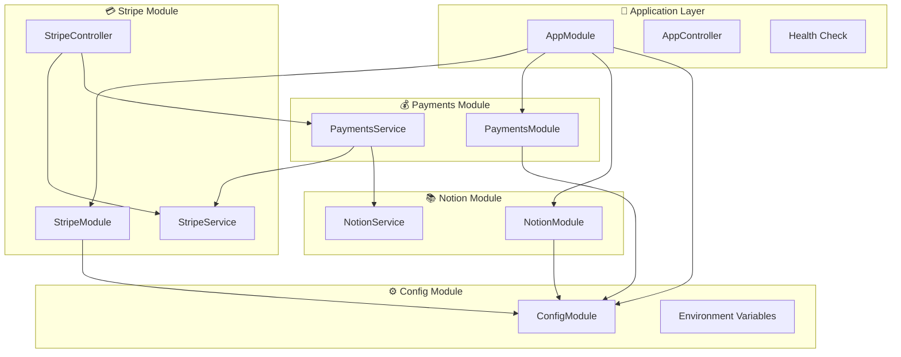
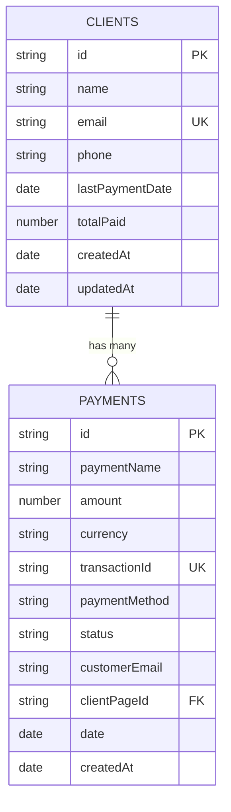
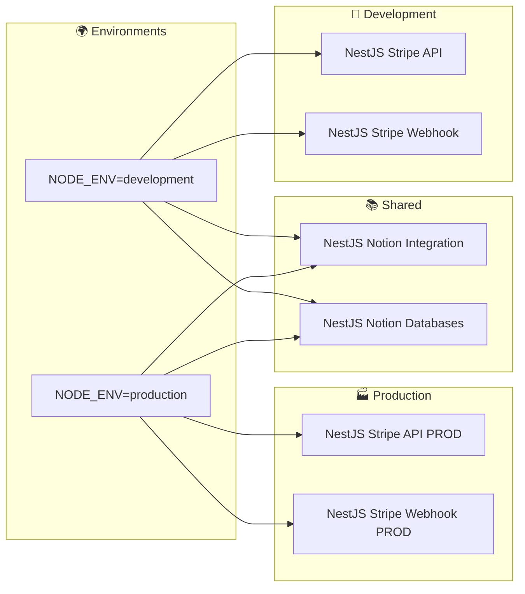
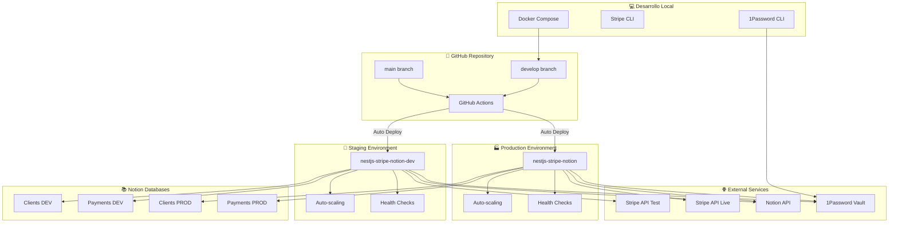
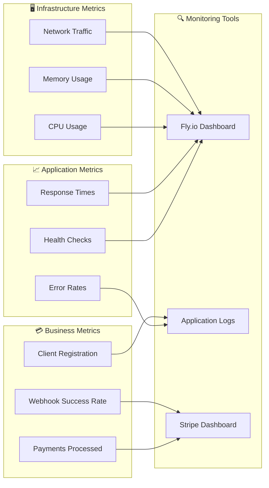

# 🏗️ Arquitectura del Sistema

Documentación técnica de la arquitectura de NestJS Stripe Notion Automation.

## 📊 Diagrama de Arquitectura General

## 🔄 Flujo de Datos Detallado

## 🏛️ Arquitectura de Módulos NestJS

## 🗃️ Estructura de Bases de Datos (Notion)

## 🔐 Gestión de Credenciales

## 🚀 Infraestructura de Deployment

## 📊 Métricas y Monitoreo

## 🔧 Tecnologías Utilizadas

| Categoría | Tecnología | Propósito |
|-----------|------------|-----------|
| **Backend** | NestJS | Framework principal |
| **Runtime** | Node.js 20 | Entorno de ejecución |
| **Package Manager** | pnpm | Gestión de dependencias |
| **Container** | Docker | Containerización |
| **Hosting** | Fly.io | Cloud hosting |
| **Payment** | Stripe | Procesamiento de pagos |
| **Database** | Notion | Base de datos y CRM |
| **Secrets** | 1Password | Gestión de credenciales |
| **Linting** | Biome | Code quality |
| **Version Control** | Git + GitHub | Control de versiones |

## 📝 Patrones de Diseño Implementados

### 🏗️ Architectural Patterns
- **Modular Architecture**: Separación en módulos funcionales
- **Dependency Injection**: IoC container de NestJS
- **Repository Pattern**: Abstracción de acceso a datos

### 🔄 Integration Patterns  
- **Webhook Pattern**: Comunicación asíncrona con Stripe
- **API Gateway Pattern**: NestJS como punto de entrada
- **Circuit Breaker**: Manejo de errores en APIs externas

### 🛡️ Security Patterns
- **Webhook Signature Validation**: Verificación de integridad
- **Environment-based Config**: Separación de credenciales
- **Secrets Management**: 1Password como vault centralizado

## 🚨 Consideraciones de Seguridad

1. **✅ Webhook Verification**: Todas las firmas son validadas
2. **✅ HTTPS Only**: Forzado en producción 
3. **✅ Environment Separation**: Credenciales separadas test/prod
4. **✅ Secrets Management**: 1Password para credenciales
5. **✅ Security Headers**: Headers de seguridad configurados
6. **✅ Non-root User**: Container ejecuta como usuario no privilegiado

## 📈 Escalabilidad

### Horizontal Scaling
- **Auto-scaling**: Fly.io maneja escalado automático
- **Load Balancing**: Distribuido por Fly.io
- **Multi-region**: Posible despliegue global

### Vertical Scaling  
- **CPU**: Escalable desde shared a dedicated
- **Memory**: Configurable desde 256MB
- **Storage**: Ephemeral, datos en Notion

### Performance Optimizations
- **Docker Multi-stage**: Imagen optimizada
- **Auto-stop/start**: Ahorro de recursos
- **Health Checks**: Detección proactiva de problemas 